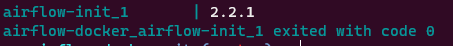
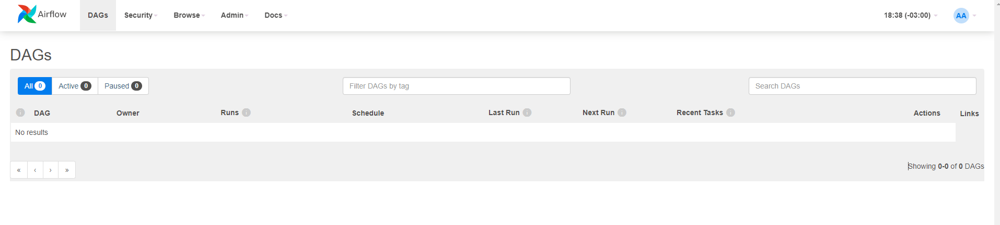

## Docker Apache Airflow 2 com LocalExecutor

### 1. Clone este repositório
```bash
git clone https://github.com/mmtze/airflow-docker.git
```
### 2. Dentro da pasta, crie os seguintes diretórios:
```bash
mkdir ./dags ./logs ./plugins
```
### 3. Configure o usúario e grupo correto do Airflow, criando um arquivo com as variáveis de ambiente:
```bash
echo -e "AIRFLOW_UID=$(id -u)\nAIRFLOW_GID=0" > .env
```
### 4. Adicione os extras de Airflow que você precisa e que não estão inclusos no [Core](https://airflow.apache.org/docs/apache-airflow/2.2.1/extra-packages-ref.html) (Exemplo com SQL Server):
* Usando o parámetro PIP para requerimentos adicionais no docker-compose.yaml (usar apenas para testar providers!):
```yaml
_PIP_ADDITIONAL_REQUIREMENTS: ${_PIP_ADDITIONAL_REQUIREMENTS:- apache-airflow-providers-microsoft-mssql}
```
* Ou, criando sua nova imagem customizada com o Dockerfile (Ver arquivo com exemplo):

```bash
docker build . -f Dockerfile --tag minha-imagem-airflow:0.0.1
```
Depois de criar a imagem, você precisa trocar o nome da imagem no docker-compose.yaml

```yaml
  image: ${AIRFLOW_IMAGE_NAME:-minha-imagem-airflow:0.0.1}
```
### 5. Inicie o banco de dados
```bash
docker-compose up airflow-init
```

### 5. Inicie os conteiners com docker-compose
```bash
docker-compose up -d
```
### 6. Confira os conteiners rodando
```bash
docker ps
```
### 7. Abra seu navegador em:
- http://localhost:8080

