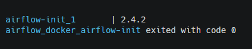

# Docker Apache Airflow with LocalExecutor


**1. Clone this repository:**
```bash
git clone https://github.com/mmtze/airflow-docker.git
```
**2. In the airflow-docker folder, create the following directories:**
```bash
mkdir ./dags ./logs ./plugins ./scripts
```

The scripts folder is not necessary for running Airflow, but it is handy for saving our scripts (.sql, .sh, etc) used in DAGs.
Learn more [here](https://docs.astronomer.io/learn/templating).

**3. Set up the correct Airflow user and group by creating a file with the environment variables. These variables will be used by PostgreSQL:**
```bash
echo -e "AIRFLOW_UID=$(id -u)\nAIRFLOW_GID=0" > .env
```


**4. Customizations (Optional):**

* 4.1 Modify Apache Airflow image version in docker-compose.yaml file:
```yaml
  image: ${AIRFLOW_IMAGE_NAME:-apache/airflow:2.4.2}
```

* 4.2 Add the Airflow extras you need that are not included in the [Core](https://airflow.apache.org/docs/apache-airflow/2.2.1/extra-packages-ref.html), using PIP parameter for additional requirements in docker-compose.yaml (Only use for testing providers!)

```yaml
_PIP_ADDITIONAL_REQUIREMENTS: ${_PIP_ADDITIONAL_REQUIREMENTS:- apache-airflow-providers-microsoft-mssql}
```
* 4.3 Create your own custom image with Dockerfile (See example file):

```bash
docker build . -f Dockerfile --tag your-image-name-airflow:0.0.1

# After creating the image, you need to change the image name in docker-compose.yaml
# image: ${AIRFLOW_IMAGE_NAME:-your-image-name-airflow:0.0.1}
```

**5. Start the PostgreSQL database:**
```bash
docker-compose up airflow-init
```


**6. Start containers with docker-compose:**
```bash
docker-compose up -d
```
**7. Check the running containers:**
```bash
docker ps
```
**7. Access your localhost:**
- http://localhost:8080


